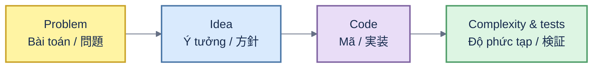

# LeetCode solutions

[English](#english) · [Tiếng Việt](#tiếng-việt) · [日本語](#日本語)

## English

A personal collection of algorithm solutions in Python, Rust, Go and SQL. Filenames start with the LeetCode problem number. Solutions are learning references rather than a packaged library.

## Tiếng Việt

Bộ sưu tập cá nhân các lời giải thuật toán bằng Python, Rust, Go và SQL. Tên file bắt đầu bằng số bài LeetCode. Đây là tài liệu học tập, không phải thư viện đóng gói.

## 日本語

Python、Rust、Go、SQL によるアルゴリズム解答の個人コレクションです。ファイル名は LeetCode の問題番号から始まります。パッケージライブラリではなく学習用の参考実装です。
