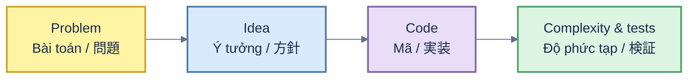

# LeetCode solutions

[English](#english) · [Tiếng Việt](#tiếng-việt) · [日本語](#日本語)

```mermaid
%%{init: {"theme":"base","themeVariables":{"background":"#FFFFFF","fontFamily":"Arial, sans-serif","lineColor":"#667085","primaryTextColor":"#172B4D"}}}%%
flowchart LR
    P["Problem<br/>Bài toán / 問題"]:::yellow
    I["Idea<br/>Ý tưởng / 方針"]:::blue
    C["Code<br/>Mã / 実装"]:::purple
    T["Complexity & tests<br/>Độ phức tạp / 検証"]:::green
    P --> I --> C --> T
    classDef yellow fill:#FFF4A3,stroke:#C9A227,stroke-width:2px,color:#172B4D
    classDef blue fill:#D9EAFD,stroke:#4C78A8,stroke-width:2px,color:#172B4D
    classDef purple fill:#E9DDF7,stroke:#8064A2,stroke-width:2px,color:#172B4D
    classDef green fill:#DDF5E3,stroke:#4F9D69,stroke-width:2px,color:#172B4D
```

## English

Repository scope: standalone solution files, no published package or shared test runner. Run each solution in its target language/problem harness; do not infer that all archived solutions pass from repository size or README examples.

A personal collection of algorithm solutions in Python, Rust, Go and SQL. Filenames start with the LeetCode problem number. Solutions are learning references rather than a packaged library.

## Tiếng Việt

Phạm vi repo: các file lời giải độc lập, không có package phát hành hoặc test runner dùng chung. Chạy từng lời giải bằng ngôn ngữ/harness của bài; số file hay ví dụ README không chứng minh mọi lời giải đã qua test.

Bộ sưu tập cá nhân các lời giải thuật toán bằng Python, Rust, Go và SQL. Tên file bắt đầu bằng số bài LeetCode. Đây là tài liệu học tập, không phải thư viện đóng gói.

## 日本語

Repository は独立した解答 file の集まりで、公開 package や共通 test runner はありません。各言語・問題の harness で検証し、file 数や README の例だけから全解答の test 成功を推定しません。

Python、Rust、Go、SQL によるアルゴリズム解答の個人コレクションです。ファイル名は LeetCode の問題番号から始まります。パッケージライブラリではなく学習用の参考実装です。
